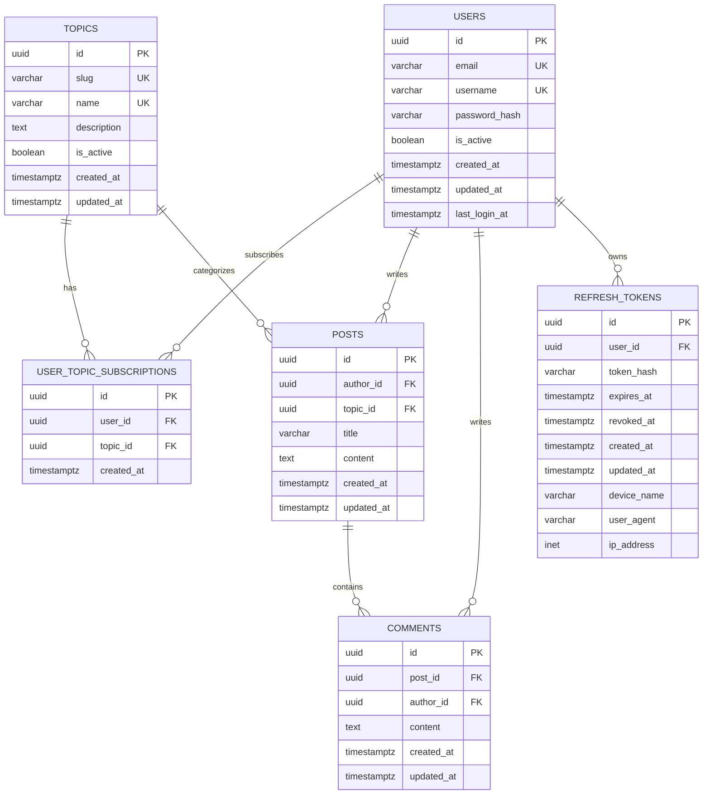

# Schéma BDD final — Projet MDD

## Objectif

Proposer un schéma de base de données PostgreSQL :
- cohérent avec les spécifications fonctionnelles du MVP,
- compatible avec une API Spring Boot sécurisée par JWT,
- propre pour une première migration Liquibase,
- suffisamment simple pour éviter la surconception,
- mais assez robuste pour permettre les évolutions futures.

---

# 1. Périmètre fonctionnel couvert

Le schéma couvre les besoins suivants du MVP :

- inscription utilisateur,
- connexion utilisateur,
- persistance de connexion entre sessions,
- consultation et modification du profil,
- consultation de la liste des thèmes,
- abonnement / désabonnement à un thème,
- consultation du fil d’actualité,
- tri du fil par date,
- création d’un article,
- consultation d’un article,
- ajout de commentaires.

Le MVP ne prévoit pas :

- de back-office,
- de likes,
- de notifications,
- de rôles complexes,
- de sous-commentaires,
- de système de modération avancé.

---

# 2. Choix structurants

## 2.1 Tables métier retenues

Le modèle repose sur 6 tables principales :

- `users`
- `topics`
- `user_topic_subscriptions`
- `posts`
- `comments`
- `refresh_tokens`

## 2.2 Pourquoi il n’y a pas de table `feed`

Le fil d’actualité n’est pas une donnée métier autonome.

C’est une **vue logique** calculée à partir :
- des abonnements de l’utilisateur,
- des articles publiés dans les thèmes suivis,
- d’un tri par date.

Créer une table `feed` dans ce MVP ajouterait de la duplication, de la complexité de synchronisation et des coûts inutiles.

## 2.3 Pourquoi il y a une table `refresh_tokens`

L’authentification repose sur JWT.

Dans une architecture propre :
- l’**access token** est court, signé, stateless, non stocké en base,
- le **refresh token** permet la persistance de connexion,
- le refresh token est stocké en base sous forme **hashée**.

Cela permet :
- la persistance entre sessions,
- le logout propre,
- la révocation,
- la rotation des tokens,
- la gestion multi-appareils si besoin.

---

# 3. Schéma Mermaid final

---

# 4. Description détaillée des tables

## 4.1 `users`

Contient les comptes utilisateur.

### Champs
- `id` : identifiant technique UUID.
- `email` : e-mail unique.
- `username` : nom d’utilisateur unique.
- `password_hash` : mot de passe hashé.
- `is_active` : permet une désactivation logique du compte si besoin.
- `created_at` : date de création.
- `updated_at` : date de dernière modification.
- `last_login_at` : date de dernière connexion réussie.

### Contraintes
- `email` unique
- `username` unique
- `email` non null
- `username` non null
- `password_hash` non null
- `is_active` non null avec valeur par défaut `true`

### Remarques
- Ne jamais stocker de mot de passe en clair.
- En Java/Spring, utiliser `BCryptPasswordEncoder`.

---

## 4.2 `topics`

Contient les thèmes du réseau social.

### Champs
- `id` : identifiant technique UUID.
- `slug` : identifiant textuel stable pour URL/API.
- `name` : nom du thème.
- `description` : description facultative.
- `is_active` : permet de masquer un thème sans supprimer les données.
- `created_at` : date de création.
- `updated_at` : date de mise à jour.

### Contraintes
- `slug` unique
- `name` unique
- `slug` non null
- `name` non null
- `is_active` non null avec valeur par défaut `true`

### Remarques
- Le `slug` est utile pour le front et pour stabiliser les références métier.
- Exemple : `spring-boot`, `angular`, `postgresql`.

---

## 4.3 `user_topic_subscriptions`

Table de jointure entre utilisateurs et thèmes.

### Champs
- `id` : identifiant technique UUID.
- `user_id` : référence vers `users.id`.
- `topic_id` : référence vers `topics.id`.
- `created_at` : date d’abonnement.

### Contraintes
- `user_id` non null
- `topic_id` non null
- contrainte unique sur `(user_id, topic_id)`

### Remarques
- Cette contrainte unique empêche le double abonnement.
- Elle est indispensable pour respecter le comportement “Déjà abonné”.

---

## 4.4 `posts`

Contient les articles publiés par les utilisateurs.

### Champs
- `id` : identifiant technique UUID.
- `author_id` : référence vers `users.id`.
- `topic_id` : référence vers `topics.id`.
- `title` : titre de l’article.
- `content` : contenu de l’article.
- `created_at` : date de création.
- `updated_at` : date de mise à jour.

### Contraintes
- `author_id` non null
- `topic_id` non null
- `title` non null
- `content` non null

### Remarques
- La date et l’auteur sont définis automatiquement à la création.
- Le tri du feed repose principalement sur `created_at`.

---

## 4.5 `comments`

Contient les commentaires d’articles.

### Champs
- `id` : identifiant technique UUID.
- `post_id` : référence vers `posts.id`.
- `author_id` : référence vers `users.id`.
- `content` : contenu du commentaire.
- `created_at` : date de création.
- `updated_at` : date de mise à jour.

### Contraintes
- `post_id` non null
- `author_id` non null
- `content` non null

### Remarques
- Pas de `parent_comment_id` dans le MVP.
- Le commentaire n’est pas récursif.
- Un commentaire appartient à un seul article.

---

## 4.6 `refresh_tokens`

Contient les refresh tokens associés aux utilisateurs.

### Champs
- `id` : identifiant technique UUID.
- `user_id` : référence vers `users.id`.
- `token_hash` : hash du refresh token.
- `expires_at` : date d’expiration.
- `revoked_at` : date de révocation si le token est invalidé.
- `created_at` : date de création.
- `updated_at` : date de mise à jour.
- `device_name` : nom d’appareil optionnel.
- `user_agent` : user-agent optionnel.
- `ip_address` : IP optionnelle.

### Contraintes
- `user_id` non null
- `token_hash` non null
- `expires_at` non null
- `created_at` non null
- `token_hash` unique

### Remarques
- Le token brut ne doit pas être stocké en base.
- Cette table ne stocke pas l’access token JWT.
- Elle sert uniquement à gérer la persistance, la révocation et la rotation des refresh tokens.

---

# 5. Règles de relation et de suppression

## 5.1 Relations principales

- un utilisateur peut avoir plusieurs abonnements,
- un thème peut avoir plusieurs abonnés,
- un utilisateur peut écrire plusieurs articles,
- un thème peut contenir plusieurs articles,
- un article peut avoir plusieurs commentaires,
- un utilisateur peut écrire plusieurs commentaires,
- un utilisateur peut avoir plusieurs refresh tokens.

## 5.2 Politique de suppression recommandée

Pour éviter les suppressions accidentelles destructrices :

- éviter `ON DELETE CASCADE` sur les entités métier principales,
- autoriser éventuellement `ON DELETE CASCADE` uniquement sur des données purement techniques comme certains tokens,
- dans le MVP, préférer une désactivation logique d’un utilisateur (`is_active`) plutôt qu’une suppression physique fréquente.

### Recommandation pragmatique

- `posts.author_id` : `RESTRICT`
- `comments.author_id` : `RESTRICT`
- `subscriptions.user_id` : `RESTRICT`
- `subscriptions.topic_id` : `RESTRICT`
- `comments.post_id` : `RESTRICT` ou `CASCADE` selon la stratégie métier
- `refresh_tokens.user_id` : `CASCADE` acceptable si suppression physique utilisateur

Le plus simple pour le MVP est de limiter fortement la suppression métier.

---

# 6. Contraintes de validation métier

## 6.1 Utilisateur

### E-mail
- obligatoire
- unique
- format valide

### Username
- obligatoire
- unique
- longueur min/max à définir côté application

### Mot de passe
Le mot de passe doit respecter :
- au moins 8 caractères,
- au moins une minuscule,
- au moins une majuscule,
- au moins un chiffre,
- au moins un caractère spécial.

### Important
Cette validation doit être faite côté back-end.
Le front peut aider, mais ne doit jamais être la seule protection.

---

## 6.2 Article

- `title` obligatoire
- `content` obligatoire
- `topic_id` obligatoire
- `author_id` défini automatiquement
- `created_at` défini automatiquement

---

## 6.3 Commentaire

- `content` obligatoire
- `post_id` obligatoire
- `author_id` défini automatiquement
- `created_at` défini automatiquement

---

# 7. Consignes JWT et sécurité session

## 7.1 Stratégie recommandée

Utiliser :
- un **access token JWT** de courte durée,
- un **refresh token** de durée plus longue,
- une table `refresh_tokens` pour la persistance de session.

## 7.2 Ce qui doit être stocké

### Access token
- non stocké en base,
- signé côté serveur,
- vérifié à chaque requête protégée.

### Refresh token
- généré aléatoirement,
- envoyé au client,
- stocké **hashé** en base,
- associé à un utilisateur,
- révocable,
- expirant.

## 7.3 Durées recommandées

Exemple raisonnable pour un MVP :
- access token : 15 minutes
- refresh token : 7 à 30 jours

## 7.4 Rotation des refresh tokens

À chaque opération de refresh :
- vérifier le refresh token,
- générer un nouvel access token,
- générer un nouveau refresh token,
- révoquer l’ancien refresh token.

Cette approche est plus sûre qu’un refresh token réutilisable indéfiniment.

## 7.5 Logout

Au logout :
- révoquer le refresh token courant,
- laisser l’access token expirer naturellement.

## 7.6 Multi-appareils

Le modèle proposé permet plusieurs sessions par utilisateur.

Chaque appareil peut posséder son propre refresh token.
Cela permet :
- une connexion mobile,
- une connexion navigateur,
- une connexion sur plusieurs postes.

## 7.7 Conseils de stockage côté client

### Recommandation prioritaire
Stocker le refresh token dans un cookie :
- `HttpOnly`
- `Secure`
- `SameSite` adapté au contexte

### Pourquoi
Cela réduit le risque d’exposition au JavaScript côté front.

---

# 8. Contraintes SQL recommandées

## 8.1 Contraintes d’unicité

- `users.email`
- `users.username`
- `topics.slug`
- `topics.name`
- `refresh_tokens.token_hash`
- `(user_topic_subscriptions.user_id, user_topic_subscriptions.topic_id)`

## 8.2 Valeurs par défaut recommandées

- `users.id` : `gen_random_uuid()` ou équivalent
- `topics.id` : `gen_random_uuid()`
- `posts.id` : `gen_random_uuid()`
- `comments.id` : `gen_random_uuid()`
- `refresh_tokens.id` : `gen_random_uuid()`
- `users.is_active` : `true`
- `topics.is_active` : `true`
- `created_at` : `now()`
- `updated_at` : `now()`

## 8.3 Types PostgreSQL recommandés

- identifiants : `uuid`
- dates : `timestamptz`
- textes longs : `text`
- booléens : `boolean`
- IP : `inet`

---

# 9. Index recommandés

## 9.1 Index minimum

- index sur `user_topic_subscriptions.user_id`
- index sur `user_topic_subscriptions.topic_id`
- index sur `posts.author_id`
- index sur `posts.topic_id`
- index sur `posts.created_at`
- index composite sur `(posts.topic_id, posts.created_at)`
- index sur `comments.post_id`
- index sur `comments.author_id`
- index sur `refresh_tokens.user_id`
- index sur `refresh_tokens.expires_at`

## 9.2 Pourquoi ces index

Ils optimisent les cas d’usage critiques du MVP :
- récupération des abonnements d’un utilisateur,
- construction du feed,
- affichage des commentaires d’un article,
- gestion des tokens actifs / expirés.

---

# 10. Requête logique du feed

Le fil d’actualité peut être reconstruit ainsi :

1. récupérer les thèmes suivis par l’utilisateur,
2. récupérer les articles appartenant à ces thèmes,
3. trier les articles par `created_at`,
4. appliquer pagination et sens de tri.

Exemple logique :

- utilisateur `U`
- récupère ses `topic_id`
- charge les `posts` où `topic_id IN (...)`
- tri `DESC` par défaut
- tri `ASC` si demandé

---

# 11. Choix techniques recommandés pour Liquibase

## 11.1 Une migration initiale unique

Vu le contexte du projet, une migration initiale unique est cohérente si :
- le périmètre MVP est stable,
- le schéma a été réfléchi avant implémentation,
- les contraintes et index sont posés proprement dès le départ.

## 11.2 Contenu de cette migration initiale

La première migration devrait inclure :
- création de toutes les tables,
- clés primaires,
- clés étrangères,
- contraintes d’unicité,
- contraintes `NOT NULL`,
- valeurs par défaut,
- index principaux.

## 11.3 Bonnes pratiques Liquibase

- nommer les contraintes explicitement,
- nommer les index explicitement,
- prévoir des rollbacks si votre stratégie projet l’impose,
- éviter les scripts SQL trop opaques si YAML/XML/JSON suffit,
- rester homogène sur tout le projet.

---

# 12. Ce qu’il ne faut pas ajouter maintenant

Pour le MVP, il vaut mieux ne pas ajouter :

- table `roles` complexe si un seul rôle utilisateur existe,
- table `likes`,
- table `notifications`,
- système de sous-commentaires,
- historisation complète des modifications,
- table de feed matérialisé,
- modération avancée,
- tags supplémentaires sur les articles.

Ces éléments peuvent venir plus tard si le produit évolue réellement.

---

# 13. Décision finale

## Schéma retenu

Le schéma PostgreSQL retenu pour le MVP de MDD est composé de :

- `users`
- `topics`
- `user_topic_subscriptions`
- `posts`
- `comments`
- `refresh_tokens`

## Pourquoi ce schéma est retenu

Il est :
- fidèle aux spécifications,
- simple à implémenter,
- propre pour Spring Boot + JPA + Liquibase,
- compatible avec une authentification JWT sérieuse,
- extensible sans casser le MVP.

## Conclusion

Ce schéma constitue une base saine pour démarrer le projet.
Il évite la surconception tout en intégrant les vrais besoins techniques dès le départ :
- intégrité des données,
- performance minimale correcte,
- sécurité de l’authentification,
- capacité d’évolution.

